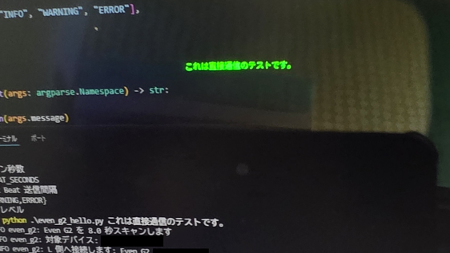

# G2 Hello World (Python)

[日本語版はこちら](README_ja.md)

A Python BLE sample app for the Even G2, based on the [Mentra OS Even G2 implementation](https://github.com/Mentra-Community/MentraOS/blob/dev/mobile/modules/bluetooth-sdk/android/src/main/java/com/mentra/bluetoothsdk/sgcs/G2.kt).

Blocks in `even_g2_hello.py` adapted from `Mentra-Community/MentraOS/.../G2.kt` are delimited by `BEGIN/END adapted from Mentra-Community/MentraOS/blob/dev/mobile/modules/bluetooth-sdk/android/src/main/java/com/mentra/bluetoothsdk/sgcs/G2.kt` comments.

Connects directly from a PC to the Even G2 and sends text. No dependency on the Even app, Mentra OS app, or a smartphone.

What this app does:

- BLE-scans and connects to the left and right lenses of Even G2
- Subscribes to notifications and waits for auth ACKs from both lenses
- Initializes following the startup sequence of the Kotlin implementation
- Creates an EvenHub page and displays Hello World
- Periodically sends EvenHub Heart Beat and DevSettings Heart Beat



## Prerequisites

- Bluetooth enabled on Windows
- Python 3.10 or later
- Both lenses of Even G2 advertising nearby (fully disconnect from any existing app, or turn off your smartphone)

## Installation

```powershell
py -3 -m pip install -r requirements.txt
```

## Usage

If only one G2 is nearby:

```powershell
py -3 even_g2_hello.py
```

Specify a display string as a positional argument:

```powershell
py -3 even_g2_hello.py "Any string"
```

Multiple words are joined with spaces:

```powershell
py -3 even_g2_hello.py Hello Even G2
```

If multiple units are nearby, filter by serial:

```powershell
py -3 even_g2_hello.py --serial 2401 "Hello World"
```

You can also use `--text` as before:

```powershell
py -3 even_g2_hello.py --text "Any string"
```

## Options

- `message`: Positional display string. Multiple words are joined with spaces.
- `--serial`: Part of the target serial number
- `--text`: Explicit display string. Alternative to the positional argument
- `--scan-timeout`: Scan duration in seconds. Default: `8.0`
- `--heartbeat-seconds`: Heart Beat send interval in seconds. Default: `5.0`
- `--log-level`: `DEBUG` / `INFO` / `WARNING` / `ERROR`

## Notes

- BLE connectivity cannot be verified without physical hardware.
- Depending on Even G2 firmware differences, additional initialization commands may be required.
- This sample focuses solely on text display and Heart Beat maintenance.

# LICENSE

MIT LICENSE

[Mentra-Community/MentraOS : MIT LICENSE](https://github.com/Mentra-Community/MentraOS/blob/dev/LICENSE)
